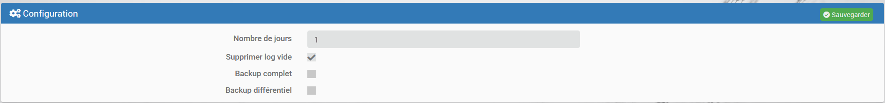

# Plugin logcleaner

Ce plugin permet de nettoyer les logs et les messages.

# Introduction

Jeedom génère des logs par plugin ainsi que des messages.
Ceux-ci sont importants pour savoir ce qu'il se passe de bien ou non.
Cependant, les logs ou les messages peuvent être trop anciens et ne plus être intéressant.
Il est alors tentant de manuellement vider ou supprimer les logs et les messages
Le plus permet de nettoyer automatiquement les logs et les messages trop anciens qui ne seront plus utiles.

# Configuration du plugin

La configuration est plutôt simple.
Elle se fait exclusivement dans la partie Générale du plugin, et il n'y a pas d'équipement à créer.

* Nombre de jours : Nombre de jours à garder.
* Supprimer log vide : Permet de supprimer les logs qui sont vides
* Backup complet : Pour tester, il peut être utile de faire une sauvegarde complète du log avant traitement.
Le fichier s'appellera zLogCleaner_<NomDuPlugin>_full.bak
* Backup différentiel : Pour tester. Ne sauvegarde que les lignes qui vont être supprimées.
Le fichier s'appellera zLogCleaner_<NomDuPlugin>_removed.bak

À noter : ces fichiers ne seront pas traités par le plugin LogCleaner.

